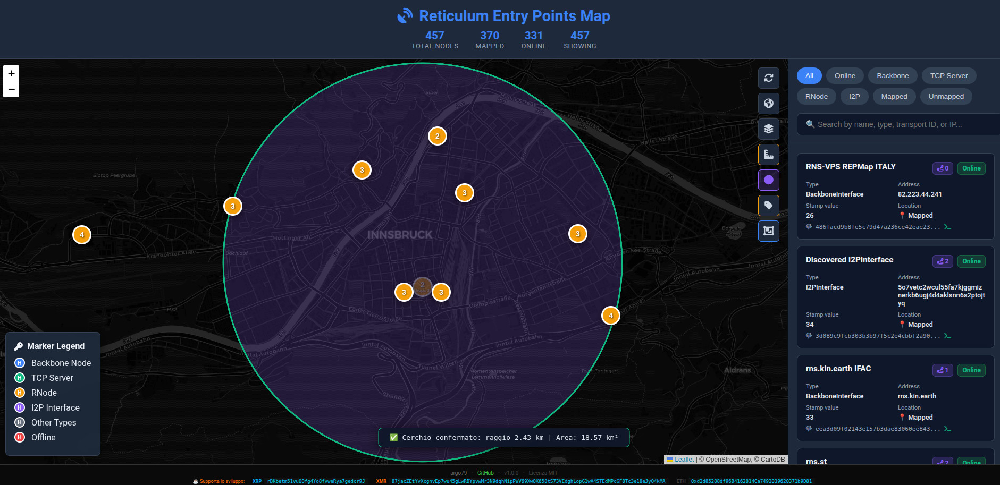
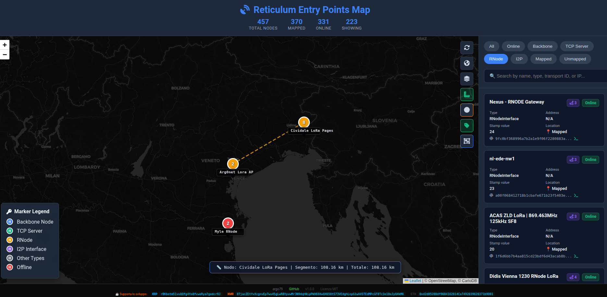

<div align="center">

# 🌐 Reticulum Entry Points Map

**Interactive map of the Reticulum Network Entry Points with automatic geolocation, node discovery and advanced network diagnostic tools.**

[](https://reticulum.network/)
[](https://www.python.org/)
[](LICENSE)
[](https://github.com/argo79/Reticulum_Entry_Points_Map/releases)
[](https://github.com/argo79/Reticulum_Entry_Points_Map/stargazers)
[](https://github.com/argo79/Reticulum_Entry_Points_Map/network/members)
[](https://github.com/argo79/Reticulum_Entry_Points_Map/issues)
[](https://github.com/argo79/Reticulum_Entry_Points_Map/commits/main)

</div>

<p align="center">
    
</p>

---

## 🌍 Overview

**Reticulum Entry Points Map** is a lightweight Python application that automatically discovers public Reticulum entry points and displays them on an interactive Leaflet map.

The project combines automatic node discovery, IP and WHOIS geolocation, interactive visualization and built-in network diagnostics into a single web interface.

Designed for both network administrators and Reticulum enthusiasts, it allows you to inspect the public network in real time without requiring external databases or heavyweight frameworks.

### Main capabilities

- 🌍 Automatic Reticulum node discovery
- 🗺️ Interactive Leaflet map
- 📍 Automatic geolocation
- 🏠 Local node visualization
- 🔄 Automatic refresh
- 📡 REST API
- 🔍 Integrated rnprobe and rnpath
- 📏 Distance ruler
- ⭕ Radius drawing tool
- 🔲 Marker clustering
- 📱 Responsive interface
- ⚡ Lightweight Python server

---

# 📋 Table of Contents

- [Overview](#-overview)
- [Features](#-features)
- [Requirements](#-requirements)
- [Quick Installation](#-quick-installation)
- [Advanced Node Commands](#-advanced-node-commands)
- [Configuration](#-configuration)
- [REST API](#-rest-api)
- [Project Structure](#-project-structure)
- [Customization](#-customization)
- [Troubleshooting](#-troubleshooting)
- [Publishing an Entry Point](#-publishing-an-entry-point)
- [Roadmap](#-roadmap)
- [Contributing](#-contributing)
- [License](#-license)

---

# ✨ Features

| Feature | Description |
|---------|-------------|
| 🗺️ Interactive Map | Displays all discoverable Reticulum nodes on a Leaflet map |
| 📍 Automatic Geolocation | Uses explicit coordinates, IP lookup, WHOIS and node names |
| 🔄 Automatic Refresh | Refreshes the network every 30 minutes |
| 🏠 Local Node Support | Automatically displays the local server |
| 📊 REST API | JSON endpoints for external applications |
| ⚡ Lightweight | Pure Python implementation with minimal dependencies |
| 🏷️ Node Labels | Labels become visible while zooming |
| 📏 Distance Ruler | Measure distances directly on the map |
| ⭕ Radius Tool | Draw circles and estimate coverage |
| 🔲 Marker Clustering | Automatically groups nearby markers |
| 🔍 Filters | Filter nodes by type and availability |
| 🎯 Diagnostic Tools | rnprobe, rnpath, ping, netcat and nmap integration |

---

# 📋 Requirements

- Python **3.6** or newer
- Reticulum installed and configured
- Internet connection
- `whois` *(optional but recommended)*

---

# 🚀 Quick Installation

## Clone the repository

```bash
git clone https://github.com/argo79/Reticulum_Entry_Points_Map.git

cd Reticulum_Entry_Points_Map
```

or download the project manually.

Required files:

```
reticulum_map.py
locations.py
map.html
style.css
ruler.js
```

---

## Configure the local node (optional)

Edit the beginning of **reticulum_map.py**.

```python
LOCAL_NODE_CONFIG = {
    "name": "My Node",
    "latitude": 45.605,
    "longitude": 12.2435,
    "reachable_on": "my.public.ip",
    "port": 4242,
}
```

---

## Start the server

```bash
python3 reticulum_map.py
```

---

## Open the web interface

Open your browser at:

```
http://localhost:8484
```

<p align="center">
    
</p>

<p align="center">
<i>Main interactive map.</i>
</p>

---

# 🎯 Advanced Node Commands

The map integrates several network diagnostic tools that can be executed directly from the web interface.

| Command | Description |
|---------|-------------|
| **rnprobe** | Tests connectivity with a Reticulum node |
| **rnpath** | Shows the current route to a node |
| **rnpath -d** | Deletes the cached route |
| **Ping** | Sends ICMP ping packets |
| **Nmap** | Performs a TCP port scan |
| **Netcat** | Tests TCP connectivity |
| **Discovery Hash** | Calculates the discovery hash for a handler |
| **Discover All** | Lists every discoverable handler |

---

## Available Discovery Hashes

The application can automatically calculate discovery hashes for several Reticulum services.

- 🔵 Probe Hash
- 📨 LXMF Propagation
- 📬 LXMF Delivery
- 📞 Audio Call
- 🌐 Nomad Network Node

<p align="center">
    
</p>

<p align="center">
<i>Node popup with integrated network tools.</i>
</p>

---

# ⚙️ Configuration

Most settings can be customized directly inside **reticulum_map.py**.

```python
PORT = 8484
REFRESH_MINUTES = 30

LOCAL_NODE_CONFIG = {
    "enabled": True,
    "name": "My Reticulum Node",
    "latitude": 45.605,
    "longitude": 12.2435,
    "reachable_on": "203.0.113.10",
    "port": 4242,
}
```

---

## 🌍 Automatic Geolocation

Node locations are determined using multiple methods, in priority order.

1. Explicit GPS coordinates included in the node announcement.
2. IP lookup using **ip-api.com**.
3. Local WHOIS analysis.
4. Location keywords extracted from the node name.

This layered approach allows most public nodes to be positioned automatically, even without GPS coordinates.

<p align="center">
    
</p>

<p align="center">
<i>Automatic node geolocation.</i>
</p>

---

# 📡 REST API

The embedded HTTP server exposes several endpoints for automation and integration.

| Method | Endpoint | Description |
|---------|----------|-------------|
| GET | `/data` | Returns every discovered node in JSON format |
| GET | `/refresh` | Forces a refresh of node data |
| GET | `/localnode` | Returns local node information |
| GET | `/get_hash/<transport>/<handler>` | Calculates a discovery hash |
| GET | `/rnprobe_hash/<hash>` | Executes **rnprobe** |
| GET | `/rnpath_hash/<hash>` | Executes **rnpath** |
| GET | `/rnpath_drop/<hash>` | Removes the cached route |
| GET | `/ping/<host>` | Executes an ICMP ping |
| GET | `/netcat/<host>/<port>` | TCP connectivity test |
| GET | `/nmap/<host>` | Port scan |
| GET | `/nmap/<host>/<port>` | Scan a specific TCP port |

---

## Example Requests

Retrieve every discovered node.

```bash
curl http://localhost:8484/data
```

Calculate the Probe hash for a specific transport.

```bash
curl http://localhost:8484/get_hash/c00058ab8a97b8cd5e20e5e570ad45d5/rnstransport.probe
```

Example response.

```json
{
    "success": true,
    "transport_id": "c00058ab8a97b8cd5e20e5e570ad45d5",
    "handler": "rnstransport.probe",
    "hash": "ca655871b843def1277cc3416cdeed54",
    "timestamp": "2026-07-24T21:00:44.089847"
}
```

<p align="center">
    
</p>

<p align="center">
<i>Responsive interface optimized for desktop, tablet and mobile devices.</i>
</p>

---

---

# 🗂️ Project Structure

```text
Reticulum_Entry_Points_Map/
├── reticulum_map.py
├── locations.py
├── map.html
├── style.css
├── ruler.js
├── robots.txt
├── sitemap.xml
├── nodes.json
├── nodes_geo.json
├── geo_cache.json
├── hash_cache.pkl
└── img/
    ├── REPMap.jpg
    ├── REPMap1.jpg
    ├── REPMap2.jpg
    ├── REPMap3.jpg
    └── REPMap4.jpg
```

---

# 🔧 Customization

## Adding Custom Locations

You can improve automatic geolocation by editing `locations.py`.

Example:

```python
LOCATIONS = {
    "milan": {
        "lat": 45.4642,
        "lng": 9.1900
    },

    "rome": {
        "lat": 41.9028,
        "lng": 12.4964
    },

    "berlin": {
        "lat": 52.5200,
        "lng": 13.4050
    },

    "new york": {
        "lat": 40.7128,
        "lng": -74.0060
    }
}
```

The geolocation engine searches node names for matching keywords before falling back to WHOIS information.

---

## Customizing the Web Interface

The frontend consists entirely of static files.

You can freely modify:

- `map.html`
- `style.css`
- `ruler.js`

or completely replace them with your own interface.

The Python server automatically serves every static file from the project directory.

---

# 🐛 Troubleshooting

## rnstatus not found

Verify that Reticulum is installed correctly.

```bash
which rnstatus
rnstatus -h
```

If not installed:

```bash
pip install rns
```

---

## Install WHOIS

### Debian / Ubuntu

```bash
sudo apt install whois
```

### Arch Linux

```bash
sudo pacman -S whois
```

### Fedora

```bash
sudo dnf install whois
```

WHOIS is optional but improves node geolocation.

---

## Server does not respond

Verify that:

- Python is running.
- Port **8484** is not blocked.
- No firewall is preventing access.
- Reticulum is working correctly.

---

## Address already in use

Find the process using port **8484**.

```bash
sudo lsof -i :8484
```

Terminate it.

```bash
sudo kill -9 PID
```

Replace **PID** with the process ID returned by `lsof`.

---

## Empty map

If the map is empty:

- verify that Reticulum is running;
- execute `rnstatus`;
- make sure some discoverable nodes exist;
- check the terminal for errors.

---

## Geolocation fails

Possible causes:

- Private IP addresses
- VPN endpoints
- Missing WHOIS package
- Unknown node names
- Temporary IP lookup API failure

Coordinates contained inside the node announcement always have the highest priority.

---

# 📍 Publishing an Entry Point

To make your Entry Point appear automatically on the map, add the following options to your Reticulum configuration.

Configuration file:

```text
~/.reticulum/config
```

Example:

```ini
discoverable = Yes
discovery_name = My Backbone Node
announce_interval = 240
discovery_stamp_value = 24

latitude = 45.4642
longitude = 9.1900
height = 15
```

---

## Complete Example

```ini
[Default Interface]
    type = AutoInterface
    enabled = Yes

[[Backbone Listener]]
    type = BackboneInterface

    interface_enabled = True
    mode = gateway

    listen_on =
    port = 4242

    discoverable = Yes
    discovery_name = RNS Backbone WORLD

    announce_interval = 360
    discovery_stamp_value = 24

    latitude = 45.4642
    longitude = 9.1900
    height = 15
```

After editing the configuration simply restart Reticulum.

Within a few announce intervals your Entry Point will automatically appear on the public map.

---

# 🔒 Privacy

Only Entry Points configured as:

```ini
discoverable = Yes
```

will appear on the map.

No additional information is collected beyond what Reticulum already publishes through the Discovery protocol.

If GPS coordinates are omitted, the application will attempt to estimate the position using IP geolocation and WHOIS information.

---

# ⚙️ Performance

Typical resource usage:

| Resource | Usage |
|----------|------:|
| RAM | ~25 MB |
| CPU | <1% idle |
| Refresh interval | 30 minutes |
| Supported nodes | Thousands |

The server is lightweight enough to run on Raspberry Pi, VPS instances and low-power hardware.

---

# 📄 License

This project is released under the **MIT License**.

See the [LICENSE](LICENSE) file for the complete license text.

---

# 👨‍💻 Author

## Arg0net

- 📧 **Email:** arg0netds@gmail.com
- 🐙 **GitHub:** https://github.com/argo79
- 🔑 **Reticulum LXMF Identity**

```text
lxmf.cb04d68b73c76647dc61a530089b7dce
```

---

# 🌟 Acknowledgements

Special thanks to the projects and people that made this software possible.

- 🌐 **Reticulum Network** for creating a truly decentralized networking protocol.
- 🗺️ **Leaflet** for the interactive mapping library.
- 📍 **ip-api.com** for the free IP geolocation service.
- 🛰️ Every Reticulum node operator contributing to the global network.
- 🇮🇹 The **Reticulum Italia** community for testing, ideas and feedback.

---

# 📊 Project Statistics

<div align="center">

[](https://github.com/argo79/Reticulum_Entry_Points_Map/stargazers)

[](https://github.com/argo79/Reticulum_Entry_Points_Map/network/members)

[](https://github.com/argo79/Reticulum_Entry_Points_Map/issues)

[](https://github.com/argo79/Reticulum_Entry_Points_Map/pulls)

[](https://github.com/argo79/Reticulum_Entry_Points_Map/commits/main)

</div>

---

# ❤️ Support the Project

If you find this project useful, consider supporting its development.

You can help by:

- ⭐ Starring the repository.
- 🍴 Forking the project.
- 🐛 Reporting bugs.
- 💡 Suggesting new features.
- 📖 Improving the documentation.
- 🔧 Submitting Pull Requests.
- 📢 Sharing the project with other Reticulum users.

---

# 🤝 Contributing

Contributions are always welcome.

1. Fork the repository.
2. Create a feature branch.

```bash
git checkout -b feature/my-feature
```

3. Commit your changes.

```bash
git commit -m "Add new feature"
```

4. Push the branch.

```bash
git push origin feature/my-feature
```

5. Open a Pull Request.

Please try to keep the coding style consistent with the rest of the project.

---

# 🚀 Future Ideas

Possible future improvements include:

- 🌍 Multiple map providers.
- 🛰️ Real-time node updates using WebSockets.
- 📈 Historical node statistics.
- 📊 Network health dashboard.
- 🌐 IPv6 visualization improvements.
- 📡 Mesh topology visualization.
- 🧭 Route quality metrics.
- 🔐 Optional authentication for API endpoints.
- 📱 Progressive Web App (PWA).
- 🌙 Dark and Light themes.

---

# 📷 Screenshots

## Node Information

<p align="center">

</p>

---

## Automatic Geolocation

<p align="center">

</p>

---

## Rnpath command

<p align="center">

</p>

---

## Rnprobe command

<p align="center">

</p>

---

## Circle Range

<p align="center">

</p>

---

## Linear Distance

<p align="center">

</p>

---

<h3>☕ Support Development</h3>

<p>
If you find this project useful, consider buying me a virtual coffee! ☕
Every contribution, big or small, helps keep the project alive and supports future development.
</p>

<div align="center">

### 💰 Donations

[](https://ripple.com/xrp/)
[](https://www.getmonero.org/)
[](https://ethereum.org/)

| Cryptocurrency | Address |
|----------------|---------|
| **XRP (Ripple)** | `rBKbetm51vuQQfg4Yo8fvweRya7gedcr9J` |
| **XMR (Monero)** | `87jacZEtYvXcgnvEp7wu45gLwRBYpvwMr3N9dqhNipPWV69XwQX658tS73VEdghLopG1wA4STEdMPcGF8Tc3e18eJyQ4kMA` |
| **ETH (Ethereum)** | `0xd2d85288df96B4162814Ca7492039620371b9D81` |

---

**Made with ❤️ by Arg0net**

<br>

📡 **Reticulum Identity**

```text
lxmf.04511923b68ae34e0fda5721d82f596f
```

<br>

⭐ If you like this project, consider giving it a **Star** on GitHub.

</div>

