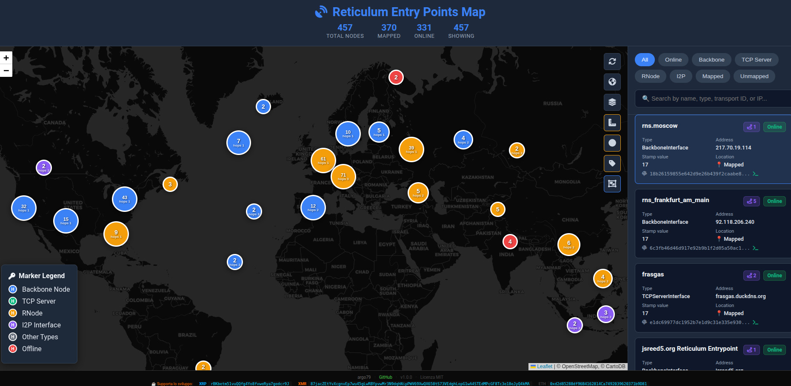
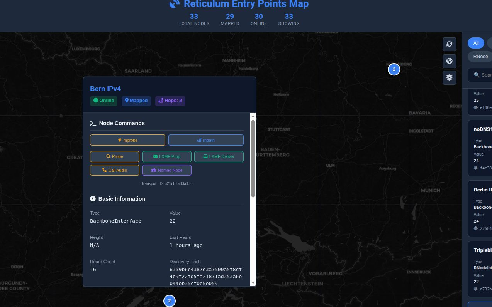
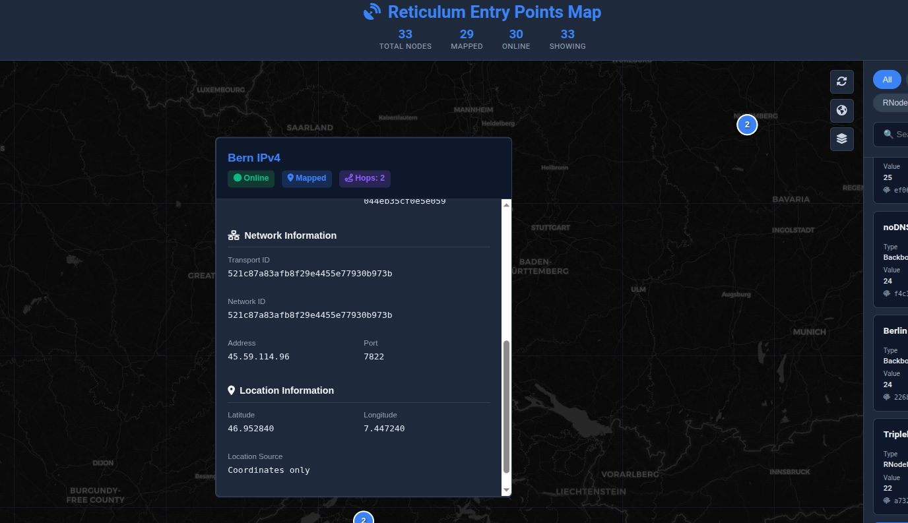
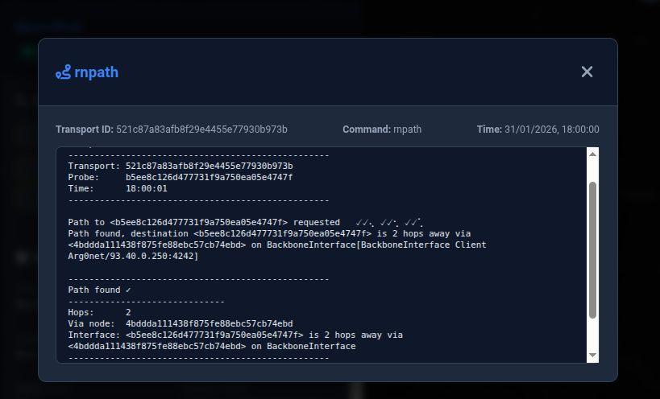
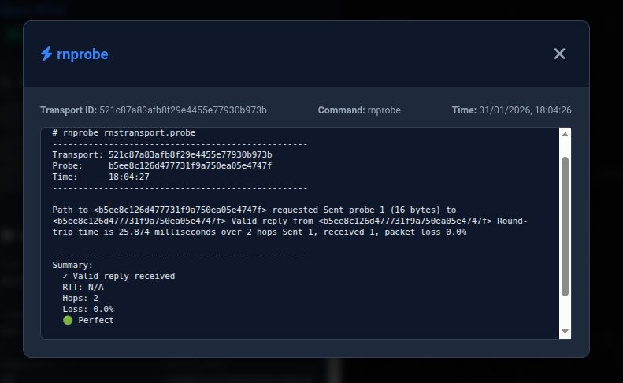

<div align="center">

# 🌐 Reticulum Entry Points Map

[](https://reticulum.network/)
[](https://www.python.org/)
[](LICENSE)
[](https://github.com/argo79/Reticulum_Entry_Points_Map/releases)
[](https://github.com/argo79/Reticulum_Entry_Points_Map/stargazers)
[](https://github.com/argo79/Reticulum_Entry_Points_Map/network/members)
[](https://github.com/argo79/Reticulum_Entry_Points_Map/issues)
[](https://github.com/argo79/Reticulum_Entry_Points_Map/commits/main)

</div>

<p align="center">
  
</p>

Server Python per visualizzare su mappa i nodi (discoverable) della rete Reticulum, con geolocalizzazione automatica e aggiornamento in tempo reale.

<div align="center">


</div>

---

## 📋 Indice
- [✨ Funzionalità](#-funzionalità)
- [📋 Prerequisiti](#-prerequisiti)
- [🚀 Installazione Rapida](#-installazione-rapida)
- [🎯 Comandi Avanzati per Nodi](#-comandi-avanzati-per-nodi)
- [⚙️ Configurazione](#️-configurazione)
- [📡 Endpoint API](#-endpoint-api)
- [🗂️ Struttura File](#️-struttura-file)
- [🔧 Personalizzazione](#-personalizzazione)
- [🐛 Risoluzione Problemi](#-risoluzione-problemi)
- [📄 Aggiunta Entry Point](#-aggiunta-entry-point-backboneinterfacei2pinterfaceecc)
- [📄 Licenza](#-licenza)
- [👨‍💻 Autore](#-autore)
- [🌟 Ringraziamenti](#-ringraziamenti)

---

## ✨ Funzionalità

| Funzionalità | Descrizione |
|--------------|-------------|
| 🗺️ **Mappa interattiva** | Visualizzazione dei nodi Reticulum su mappa Leaflet |
| 📍 **Geolocalizzazione automatica** | IP, WHOIS, nomi nodi, coordinate esplicite |
| 🔄 **Auto-refresh** | Aggiornamento automatico ogni 30 minuti |
| 🏠 **Nodo locale** | Inclusione automatica del server come nodo |
| 📊 **API JSON** | Endpoint per integrazioni esterne |
| ⚡ **Server leggero** | HTTP server in Python, veloce e senza dipendenze pesanti |
| 🏷️ **Etichette nodi** | Nomi visibili a zoom alto |
| 📏 **Righello** | Misura distanze sulla mappa |
| ⭕ **Circonferenza** | Disegna cerchi con raggio personalizzabile e calcolo area |
| 🔲 **Clustering** | Raggruppamento dinamico dei nodi per mappe pulite |
| 🔍 **Filtri** | Filtra per tipo, stato, mappati/non mappati |
| 🎯 **Comandi avanzati** | rnprobe, rnpath, ping, nmap, netcat integrati |

---

## 📋 Prerequisiti

- Python 3.6 o superiore
- Reticulum installato e configurato
- Connessione internet (per geolocalizzazione)
- `whois` (opzionale, per geolocalizzazione avanzata)

---

## 🚀 Installazione Rapida

### 1. Scarica i file

```bash
git clone https://github.com/argo79/Reticulum_Entry_Points_Map.git
cd Reticulum_Entry_Points_Map
```
Oppure scarica manualmente:

    reticulum_map.py (server principale)

    locations.py (modulo di geolocalizzazione)

    map.html (pagina web)

    style.css (stili)

    ruler.js (strumenti di misurazione)

2. Configura il tuo nodo (OPZIONALE)

Modifica le variabili in cima a reticulum_map.py:
python

LOCAL_NODE_CONFIG = {
    "name": "Il Tuo Nodo",              # Nome del tuo nodo
    "latitude": 45.605,                 # Tua latitudine
    "longitude": 12.2435,               # Tua longitudine
    "reachable_on": "tuo.ip.pubblico",  # Tuo IP pubblico
    "port": 4242,                       # Tua porta Reticulum
    # ... altre impostazioni
}

3. Lancia il server
bash

python3 reticulum_map.py

4. Accedi alla mappa

Apri il browser e vai su: http://localhost:8484
<p align="center">  <br> <em>Visualizzazione principale della mappa</em> </p>
🎯 Comandi Avanzati per Nodi

La mappa include funzionalità avanzate per interagire con i nodi:
Comando Descrizione
rnprobe Test di connettività verso il nodo
rnpath  Trova il percorso di rete verso il nodo
rnpath -d   Drop/reset del percorso del nodo
Ping    ICMP ping verso host IPv4/nomi dominio
NMAP    Scan delle porte sui nodi (se porta disponibile)
Netcat  Test TCP di connettività
Discovery hash  Ottieni hash per servizi specifici
Discover All    Scopri tutti gli handler disponibili per il nodo
Hash disponibili

    🔵 Probe Hash - per rnprobe/rnpath

    📨 LXMF Propagation Hash

    📬 LXMF Delivery Hash

    📞 Call Audio Hash

    🌐 Nomad Network Node Hash

<p align="center">  <br> <em>Popup con comandi e informazioni del nodo</em> </p>
⚙️ Configurazione

Parametri principali (in reticulum_map.py):
python

PORT = 8484                          # Porta del server web
REFRESH_MINUTES = 30                 # Auto-refresh in minuti

🔍 Geolocalizzazione

Il sistema usa 4 livelli di geolocalizzazione (priorità decrescente):

    Coordinate esplicite nel JSON di rnstatus

    API IP (ip-api.com) - più accurato

    WHOIS locale - analisi dominio/IP

    Nomi nodi - ricerca parole chiave

<p align="center">  <br> <em>Dettagli nodo con geolocalizzazione</em> </p>
📡 Endpoint API
Endpoint    Descrizione
GET /data   Dati JSON completi di tutti i nodi
GET /refresh    Refresh manuale dei dati
GET /localnode  Info del nodo locale
GET /get_hash/<transport_id>/<handler>  Ottieni hash per handler specifico
GET /rnpath_hash/<hash> Esegui rnpath con hash
GET /rnprobe_hash/<hash>    Esegui rnprobe con hash
GET /ping/<address> Esegui ping (2 pacchetti, 2s intervallo)
GET /netcat/<host>/<port>   Test TCP con netcat
GET /nmap/<host>[/<port>]   Esegui scansione nmap
GET /rnpath_drop/<hash> Drop/reset percorso con rnpath -d
Esempi
bash

# Ottieni tutti i dati
curl http://localhost:8484/data

# Ottieni hash probe per un nodo
curl http://localhost:8484/get_hash/c00058ab8a97b8cd5e20e5e570ad45d5/rnstransport.probe

json

{
  "success": true,
  "transport_id": "c00058ab8a97b8cd5e20e5e570ad45d5",
  "handler": "rnstransport.probe",
  "hash": "ca655871b843def1277cc3416cdeed54",
  "timestamp": "2026-07-24T21:00:44.089847"
}

<p align="center">  <br> <em>Visualizzazione mobile e responsive</em> </p>
🗂️ Struttura File
text

reticulum-map/
├── reticulum_map.py      # Server principale
├── locations.py          # Modulo geolocalizzazione
├── map.html              # Pagina web
├── style.css             # Stili CSS
├── ruler.js              # Strumenti di misurazione
├── robots.txt            # SEO robots
├── sitemap.xml           # Sitemap per motori di ricerca
├── nodes.json            # Dati raw da rnstatus
├── nodes_geo.json        # Dati con coordinate
├── geo_cache.json        # Cache geolocalizzazione
├── hash_cache.pkl        # Cache hash nodi
└── img/                  # Immagini
    ├── REPMap.jpg
    ├── REPMap1.jpg
    ├── REPMap2.jpg
    ├── REPMap3.jpg
    └── REPMap4.jpg

🔧 Personalizzazione
Aggiungere nuove location

Modifica LOCATIONS in locations.py:
python

LOCATIONS = {
    'milan': {'lat': 45.4642, 'lng': 9.1900},
    'rome': {'lat': 41.9028, 'lng': 12.4964},
    'london': {'lat': 51.5074, 'lng': -0.1278},
    # Aggiungi le tue città...
}

Modificare la pagina web

Crea o modifica map.html personalizzato. Il server serve file statici dalla directory corrente.
🐛 Risoluzione Problemi
"rnstatus non trovato"

Assicurati che Reticulum sia installato e nel PATH:
bash

# Verifica installazione
which rnstatus
rnstatus -h

# Se manca, installa Reticulum
pip install rns

Installare whois (per geolocalizzazione avanzata)
bash

# Debian/Ubuntu
sudo apt install whois

# Arch
sudo pacman -S whois

# Fedora
sudo dnf install whois

Server non risponde

    Controlla che la porta 8484 non sia bloccata

    Verifica i permessi di esecuzione

    Controlla i log di errore nel terminale

Address already in use
bash

# Trova il processo sulla porta 8484
sudo lsof -i :8484

# Uccidi il processo
sudo kill -9 <PID>

📄 Aggiunta Entry Point (BackboneInterface, I2PInterface, ecc.)

Se gestite o controllate un'interfaccia di tipo Server (TCP, Backbone, I2P, IPv6, RNode) e volete farla apparire in mappa, aggiungete queste righe nel file ~/.reticulum/config:
```ini

discoverable = Yes
discovery_name = Nome senza ""
announce_interval = 240  # 4 ore
discovery_stamp_value = 24
# Optional location data
latitude = 0.123
longitude = 98.7654
height = 15

Esempio completo:
ini

[Default Interface]]
    type = AutoInterface
    enabled = Yes

[[Backbone Listener]]
    type = BackboneInterface
    interface_enabled = True
    mode = gateway
    listen_on = 
    port = 4242
    discoverable = Yes
    discovery_name = RNS Backbone WORLD 
    announce_interval = 360   
    discovery_stamp_value = 24
    # Optional location data
    latitude = 0.123 
    longitude = 98.7654
    height = 12

```
Riavviare RNS per applicare le modifiche.
📄 Licenza

MIT License - vedi file LICENSE
👨‍💻 Autore

Arg0net
```
    📧 Email: arg0netds@gmail.com

    🔑 Reticulum Identity: lxmf.cb04d68b73c76647dc61a530089b7dce

    🐙 GitHub: argo79

🌟 Ringraziamenti

    Reticulum Network per l'infrastruttura decentralizzata

    ip-api.com per il servizio di geolocalizzazione gratuito

    Leaflet per la libreria di mappe interattive

    Tutti i nodi della rete Reticulum che rendono possibile questa visualizzazione

    Il canale Telegram Reticulum Italia per il supporto
```
📊 Statistiche
<div align="center">

https://img.shields.io/github/stars/argo79/Reticulum_Entry_Points_Map?style=social
https://img.shields.io/github/forks/argo79/Reticulum_Entry_Points_Map?style=social
https://img.shields.io/github/issues/argo79/Reticulum_Entry_Points_Map
</div><p align="center"> <i>🌐 Connesso alla rete. Decentralizzato. Libero.</i> </p><p align="center"> <i>📡 Contattami via Reticulum usando l'identity hash sopra!</i> </p> ```